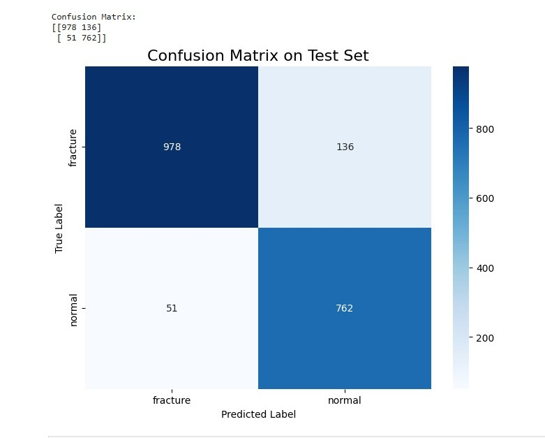
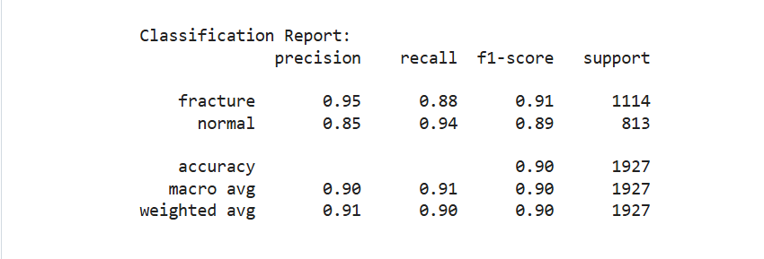

# Deep Learning-Based Fracture Detection in Radiographic Images

This repository presents a pipeline for fine-tuning a vision-language model for fracture detection in trauma X-rays. It uses parameter-efficient fine-tuning with QLoRA to adapt the model for binary diagnostic assessment.

---

## Project Overview

Identifying fractures in trauma X-rays can be challenging, particularly when fractures are subtle or overlap with complex anatomical structures. Automated fracture detection can therefore serve as a valuable clinical decision-support tool by assisting with the identification of potentially abnormal studies.

This project formulates fracture detection as an instruction-following task rather than a conventional image-classification problem. The model receives an X-ray together with a clinical diagnostic prompt and generates one of two assessments: 

- **Fracture:** Radiographic evidence of a fracture is detected.
- **Normal:** No radiographic evidence of a fracture is detected.

Through multimodal instruction tuning, the model learns to associate visual patterns in trauma radiographs with clinically framed diagnostic requests. 

---

## Model Architecture and Fine-Tuning

The training pipeline adapts a pretrained Vision-Language Model using Quantized Low-Rank Adaptation (QLoRA). This approach significantly reduces memory requirements by keeping the base model frozen and updating only a small set of LoRA parameters.

| Component | Configuration |
|---|---|
| **Base model** | `Qwen2.5-VL-3B-Instruct` |
| **Quantization** | 4-bit NF4 with double quantization |
| **Compute data type** | `bfloat16` |
| **Fine-tuning method** | QLoRA with RSLoRA |
| **Target modules** | `q_proj`, `k_proj`, `v_proj`, `o_proj` |
| **LoRA rank** | 16 |
| **LoRA alpha** | 32 |
| **Memory optimization** | Gradient checkpointing |
| **Training framework** | Hugging Face Transformers and TRL `SFTTrainer` |

A custom multimodal data collator prepares the image-text conversations, tokenizes the inputs, and masks non-target tokens so that the loss is calculated only on the intended assistant response.

Only the LoRA adapter parameters are updated during training, while the original 3B-parameter model remains frozen. This reduces the number of trainable parameters to a small fraction of the complete model. 

---

## Data & Split Methodology

- **Task framing**: binary classification (fracture / normal) on X-rays
- **Split strategy**: patient-level stratified splitting (90% train / 5% validation / 5% test). Splitting is done at the **patient** level, not the image level — all images belonging to a given patient are placed entirely within a single split, preventing data leakage where a model could see one image of a patient during training and be evaluated on a different image of the same patient.
- **Class distribution**:

| Split | Fracture | Normal |
|---|---|---|
| Train | 19,964 | 15,270 |
| Validation | 1,084 | 807 |
| Test | 1,114 | 813 |

- **Reproducibility**: a fixed random seed (42) is used for the patient-level split.
- **Preprocessing & augmentation**: raw data preprocessing and image augmentation were handled in a separate pipeline.

---

## Training Configuration

The model is fine-tuned using the following configuration:

| Parameter | Value |
|:---|:---|
| **Epochs** | 2 |
| **Batch size per device** | 4 |
| **Gradient accumulation steps** | 4 |
| **Effective batch size** | 16 |
| **Learning rate** | `5 × 10⁻⁵` |
| **Learning-rate schedule** | Cosine |
| **Warmup ratio** | 5% |
| **Weight decay** | 0.01 |
| **Training precision** | `bfloat16` |
| **Checkpoint selection** | Lowest validation loss |

The validation set is used during training to monitor generalization and select the best-performing checkpoint. The test set remains completely held out until final evaluation.

---

## Evaluation Results

The model was evaluated on a held-out test set of **1,927 trauma X-rays**. The test data remained separate from model training, validation, hyperparameter selection, and checkpoint selection. Patient-level separation was maintained to ensure that the reported performance reflects generalization to previously unseen patients.

  
  

The model achieved an overall **accuracy of 90%**, correctly classifying 1,740 of the 1,927 test images. Both the macro-average and weighted-average F1-scores were **0.90**, indicating strong and relatively consistent performance across the two classes.

The model performed particularly well when confirming fracture predictions. Its **fracture precision of 0.95** means that only a small proportion of images predicted as fractures were actually normal. The resulting fracture F1-score of **0.91** demonstrates a strong overall balance between correctly identifying fractures and limiting false fracture predictions. For normal X-rays, the model achieved a **recall of 0.94**, correctly recognizing 762 of the 813 normal cases. The normal-class F1-score of **0.89** shows that the model maintained reliable performance for this class. Overall, the results indicate that the model is highly reliable when it predicts a fracture. This performance profile favors precision over sensitivity for fracture detection.

